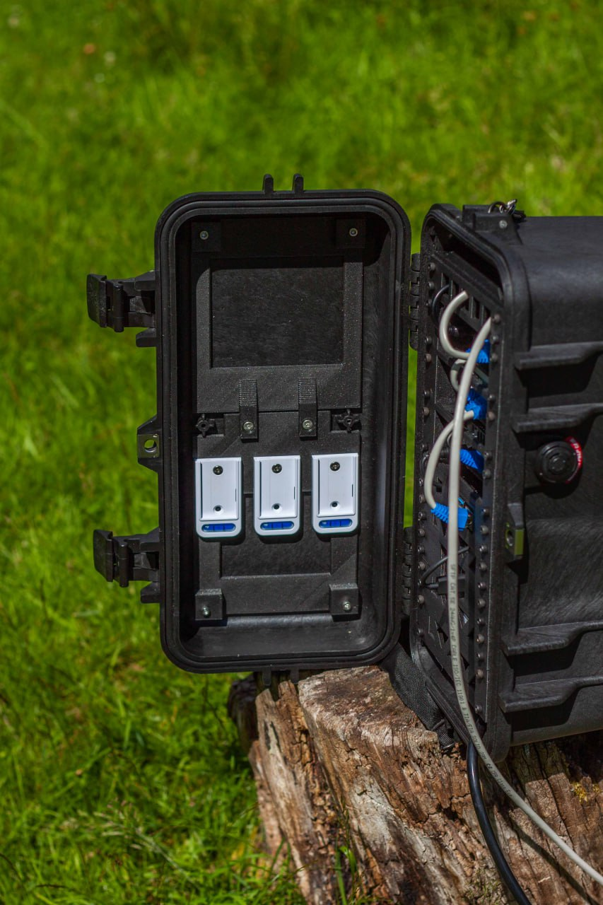

# Prepare the case

{{BOM}}

## Construct the lid insert {pagestep}

* Join [AP Mount Top](fromstep){qty:1,cat:printed} and [AP Mount Bottom](fromstep){qty:1,cat:printed} together using two [M4x10mm countersunk screws]{qty: 2,cat: mech} and a [3mm Allen Key]{qty: 1,cat: tool}
* Using three more [M4x10mm countersunk screws]{qty: 3,cat: mech} attach the brackets that came with your three UniFi Access Points to the holes just below the join between the two prints.

## Attach to case{pagestep}

* Get your [Peli Case][Peli Case 1430]{qty:1} and open the lid.
* Locate the mounting lugs on the peli case lid and align the lid insert with these lugs
* Use [M4x10mm cap screws]{qty: 2,cat: mech} to attach the inset into the Peli Case.

