# Construct the and populate the rack

>!! **TODO**
>!!
>!! * All written instructions after step 1.
>!! * include adding final screws

{{BOM}}

## Attach the legs to the bottom{pagestep}

* Get the [bottom](fromstep){qty:1, cat:printed} and the four [rack legs](fromstep){qty:4, cat:printed} that you printed earlier.
* Get an [3mm Allen Key]{qty:1, cat:tool} ready
* Use four [M4x10mm countersunk screws]{qty:4} to attach a leg to each corner of the bottom.

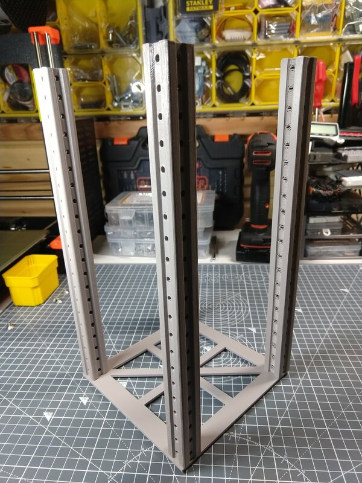

## Add the shelves {pagestep}

Each draw uses [M4x10mm cap screws]{qty:2, cat:mech}
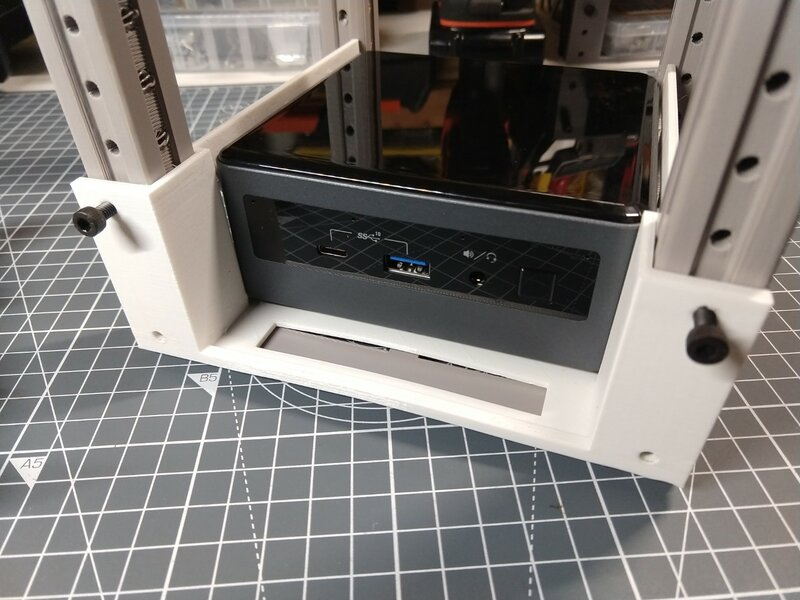
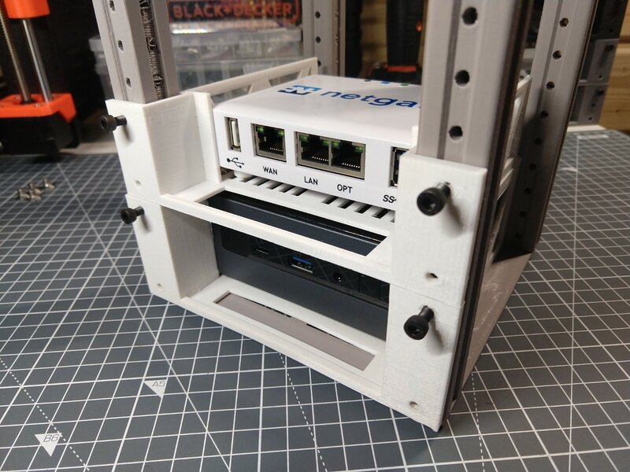
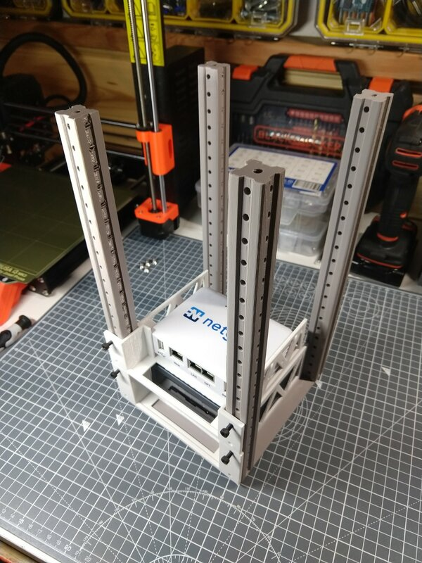

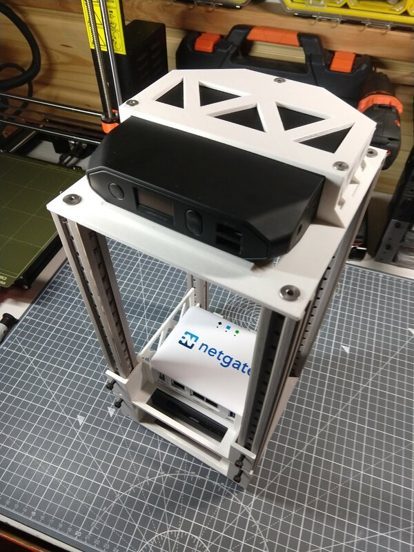

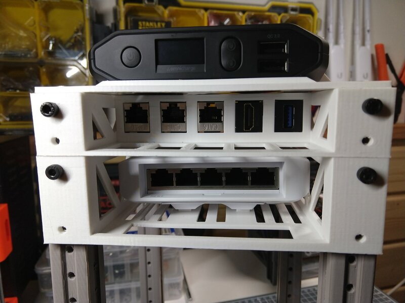

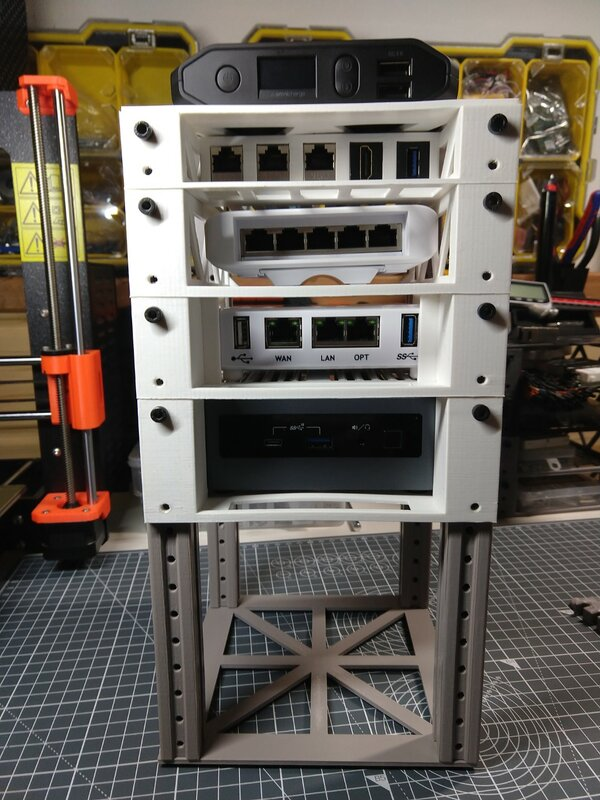
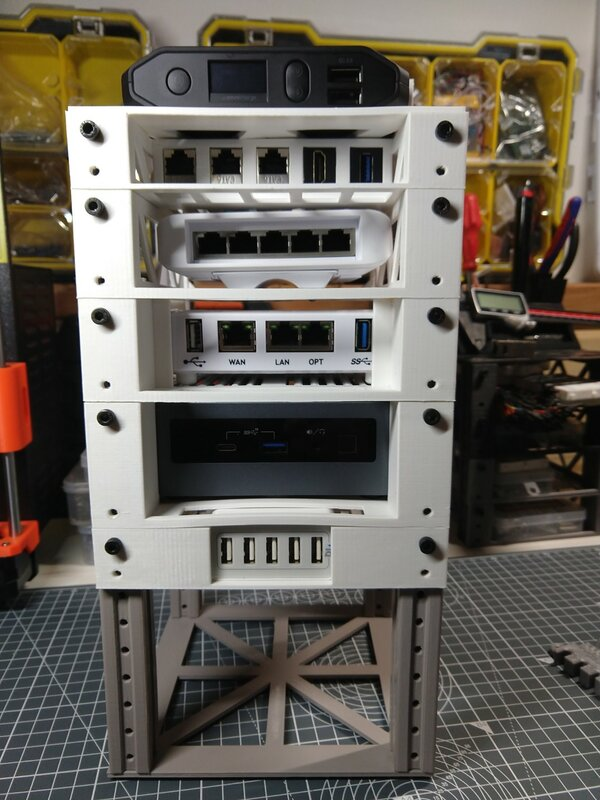
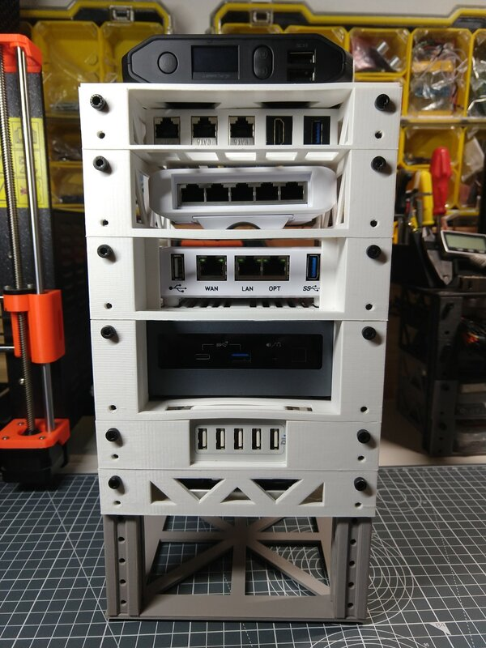

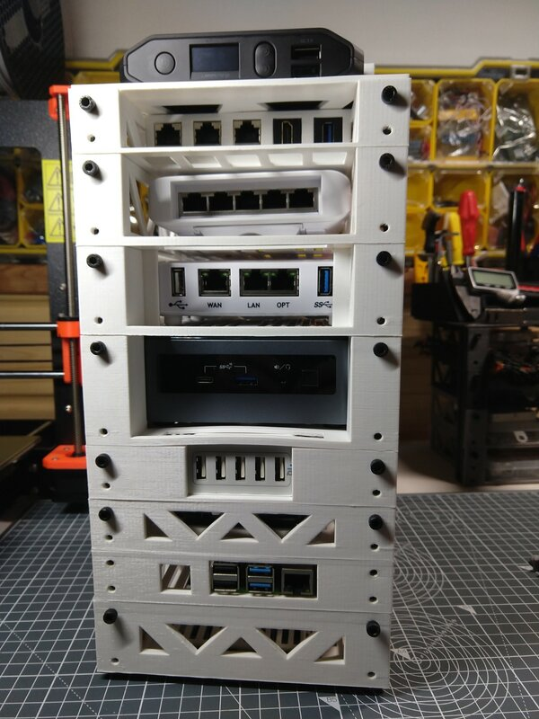
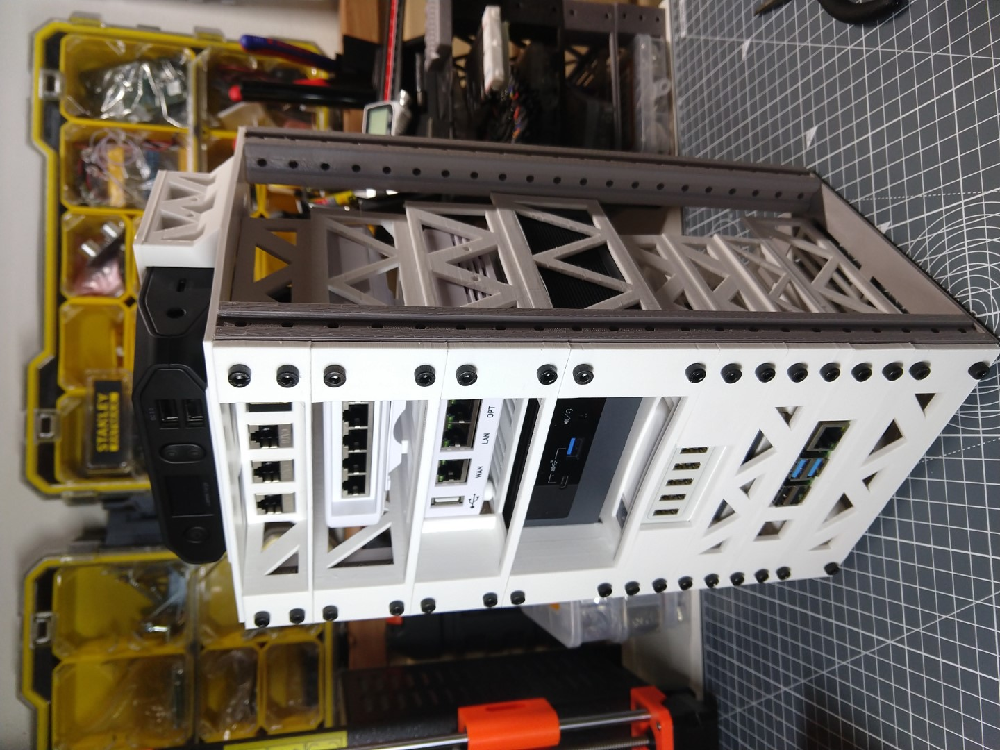

