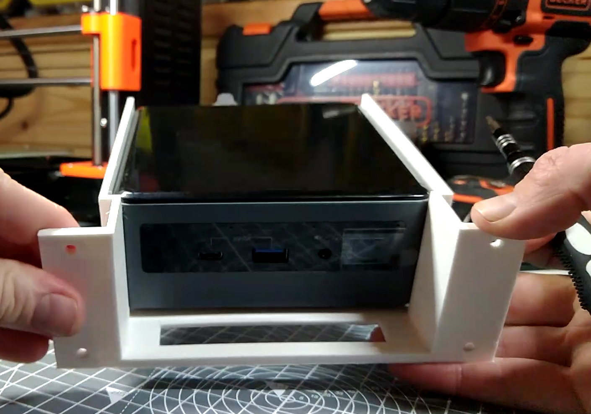
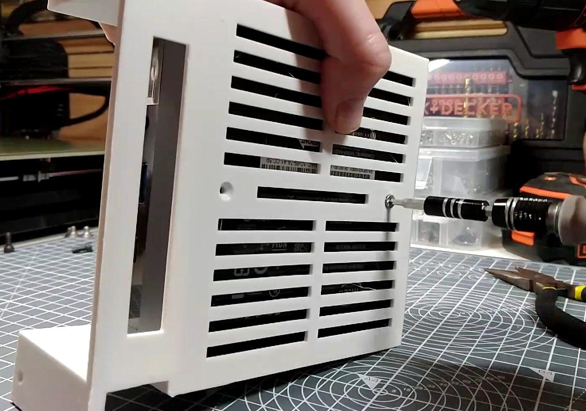

# Assemble the NUC computer shelf

{{BOM}}

[M3x6mm countersunk screws]: parts/Hardware.yaml#CskScrew_M3x6mm_SS

## Position the computer{pagestep}

* Take the [NUC Shelf](fromstep){qty:1, cat:printed} you printed earlier
* Position the [NUC computer](parts/NUC_Computer.md){qty:1, cat:net} on the shelf so that front of the computer sits just behind where the shelf narrows

## Secure the computer {pagestep}

* Firmly hold the computer in place on the shelf with one hand.
* Turn the shelf and computer over so you can access the bottom of the shelf
* Use two [M3x6mm countersunk screws]{qty:2} and an [2.5mm Allen key](parts/metric_allen_keys.md){qty:1, cat:tool} to secure the computer in place

[Assembled NUC Shelf]{output, qty:1, hidden}