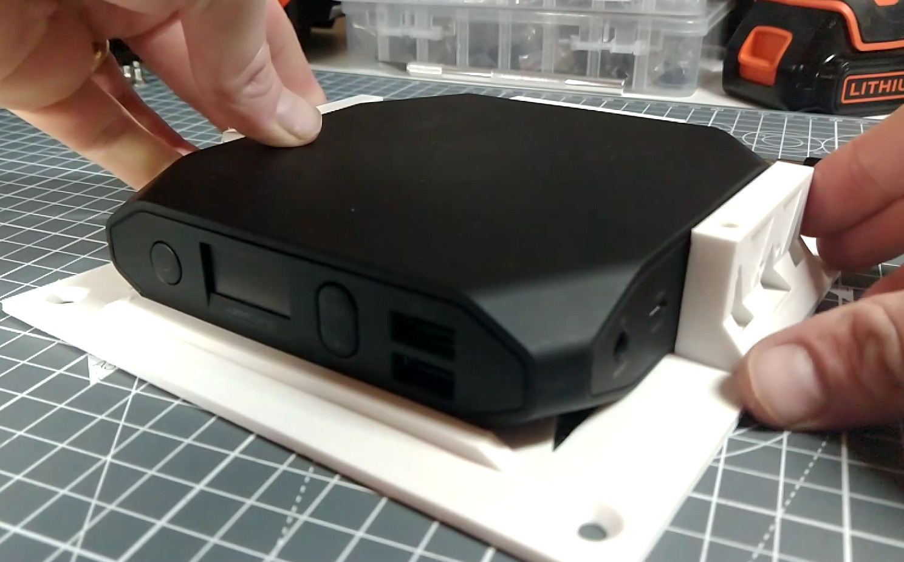
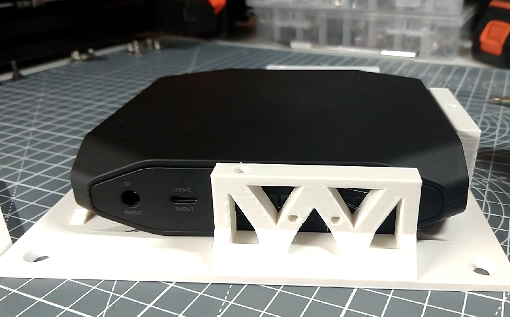
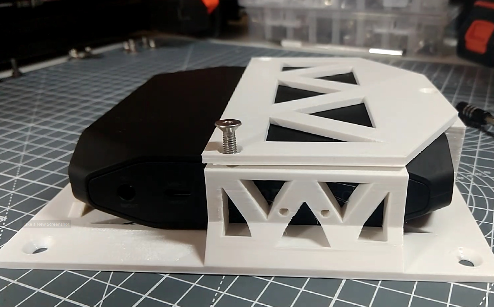
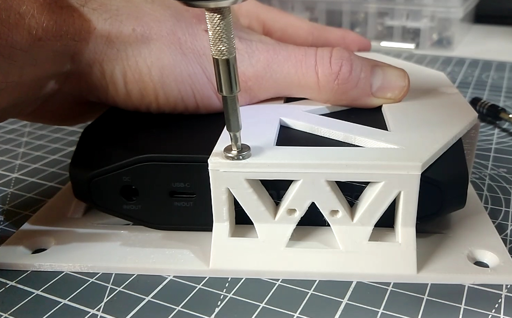
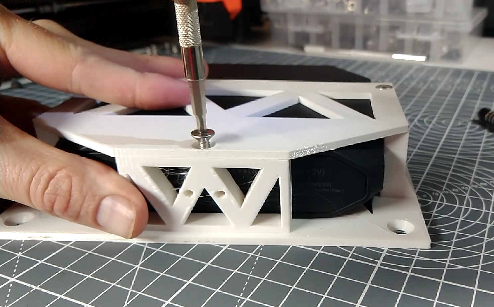

# The OmniCharge shelf

## Assembling the OmniCharge shelf

{{BOM}}

[M4x10mm countersunk screws]: parts/Hardware.yaml#CskScrew_M4x10mm_SS

## Position the OmniCharge{pagestep}

>i Note that this shelf forms the top of the rack, so looks a bit different.

* Take the [Omni Shelf]{make, qty:1, cat:printed} you printed earlier.
* Position the [Omni 20C+](parts/Omni20Cplus.md){qty:1, cat:net} so that the front of the device is not blocked

## Secure the OmniCharge{pagestep}

* Take the [Omni Shelf Lid]{make, qty:1, cat:printed} you printed earlier and place it over the Omni, aligning the three countersunk holes with the holes on the shelf.
* Use three [M4x10mm countersunk screws]{qty:3} and an [3mm Allen key](parts/metric_allen_keys.md){qty:1, cat:tool} to secure the computer in place

