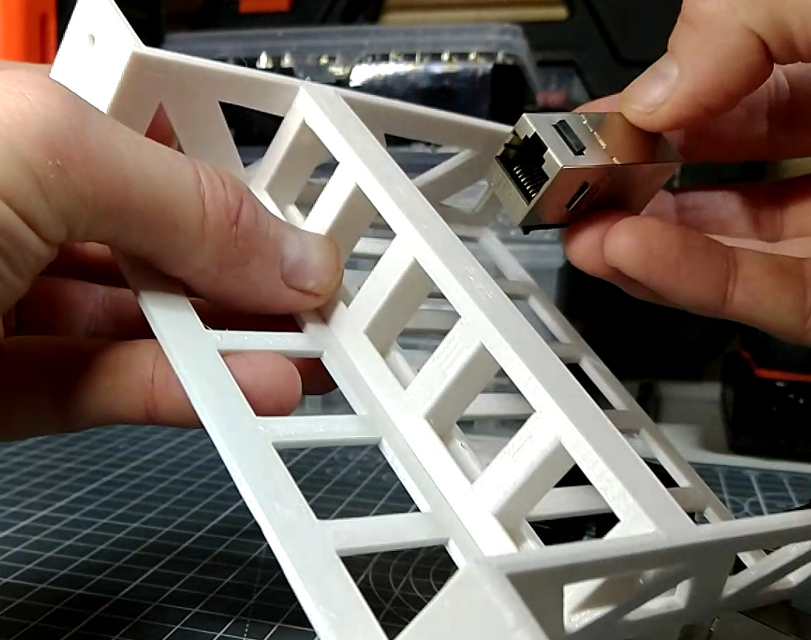
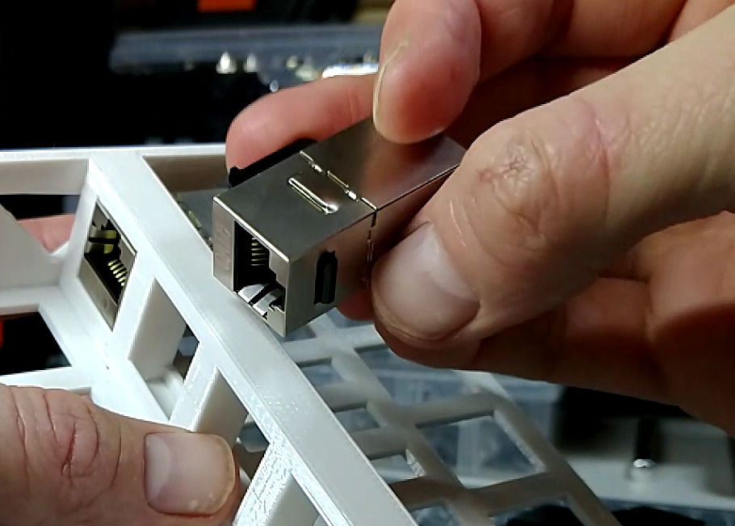
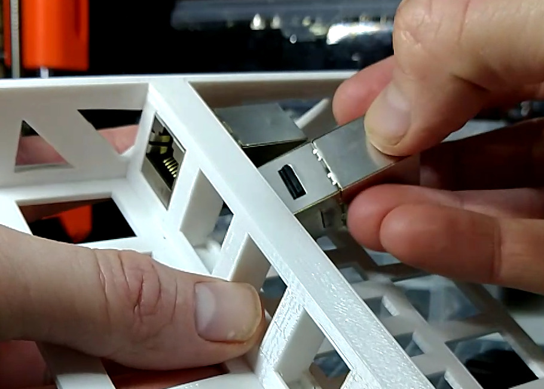
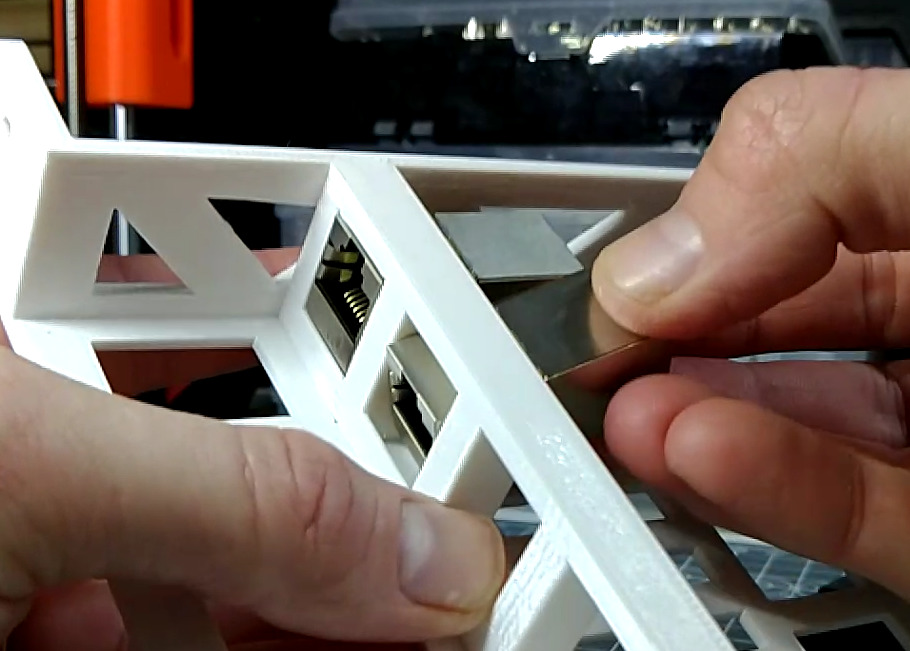
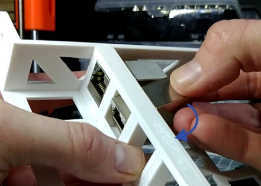
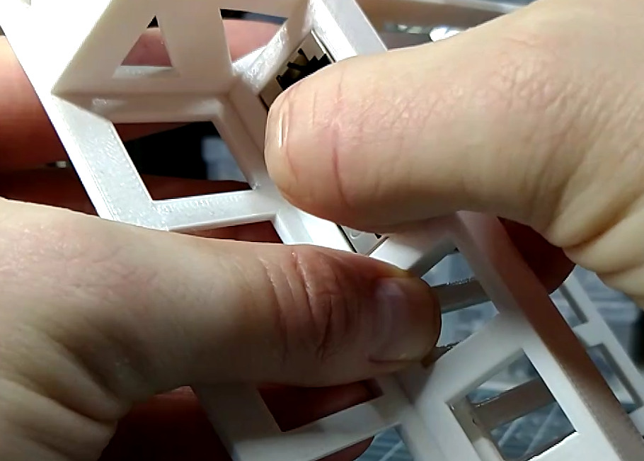
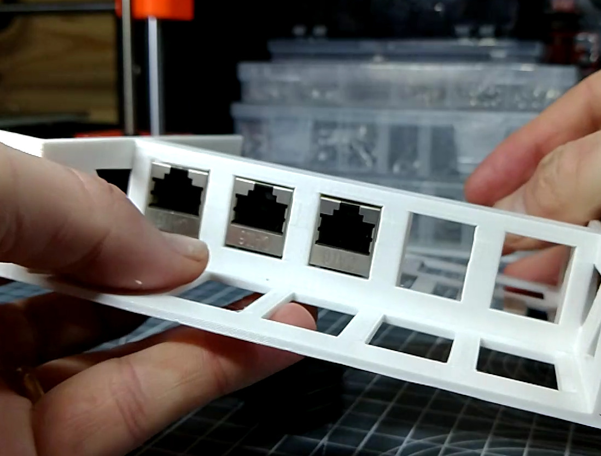
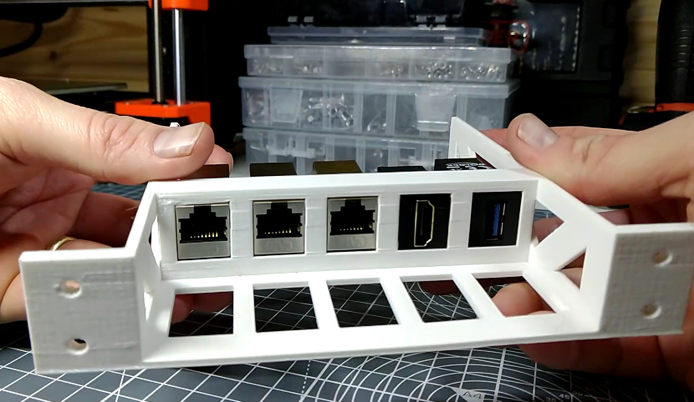

# The Patch Pannel

## Assembling the Patch Pannel

{{BOM}}

>i **Struggling to inset keystones?**  
>i If you are struggling to insert the keystones following the instructions on this page, a flat head screwdriver can be used to gain a little more leverage.
>i 
>i Be careful whenever using screwdriver to lever as the screwdriver can slip causing injury.

## Attach the Ethernet Keystones{pagestep}

* Take the [Patch panel]{make, qty:1, cat:printed} you printed earlier and three [ethernet keystones][Ethernet Keystones](parts/EthernetKeystone.md){qty:3, cat:net}
* These will be clipped into the three left hand panels

**For each keystone**:

* Locate the top of the keystone with the catch

* Tip the keystone into the hole, rotate it downwards until it clicks into place
*{info} It might help to support the front of the keystone with your thumb as your click it into place.

* Once done it should look like this.

## Attach the HDMI and USB Keystones{pagestep}

* Repeat this process for an [HDMI Keystone](parts/HDMIKeystone.md){qty:1, cat:net} and a [USB Keystone](parts/USBKeystone.md){qty:1, cat:net}
*{info} Note that the keystones are mounted rotated by 90 degrees.

