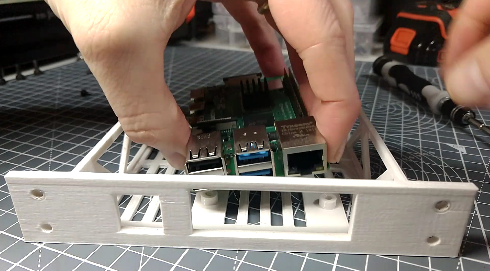
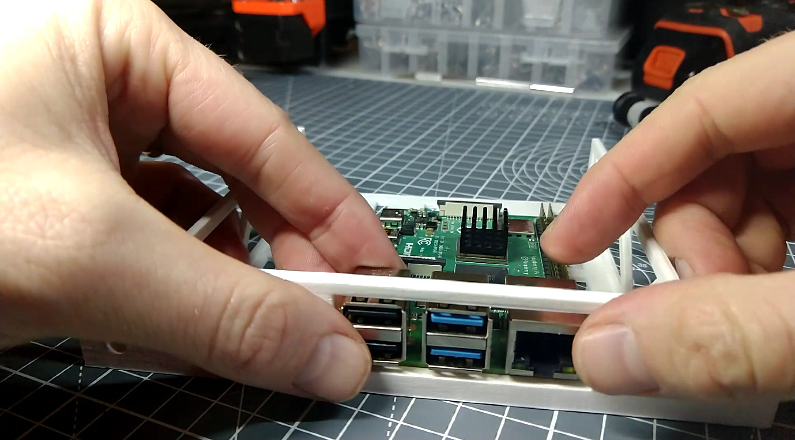
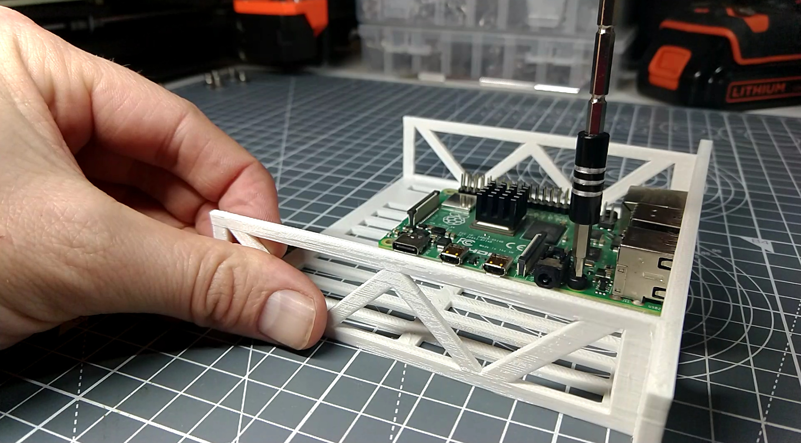

# Assemble the Pi Shelf

{{BOM}}

[M2.5x6mm cap screws]: parts/Hardware.yaml#CapScrew_M2.5x6mm_SS

## Position the Raspberry Pi {pagestep}

* Take the [Raspberry Pi Shelf](fromstep){qty:1, cat:printed} you printed earlier

* Position the [Raspberry Pi 4B](parts/RPi_4B.md){qty:1, cat:net} on the shelf so that the ports align with the large hole

## Secure the Raspberry Pi {pagestep}

* Adjust the Raspberry Pi so that the 4 lugs on the tray align with the 4 holes in the PCB
* Using four [M2.5x6mm cap screws]{qty:4} and a [2mm Allen key](parts/metric_allen_keys.md){qty:1, cat:tool}, secure the pi to the shelf.

[Assembled Raspberry Pi Shelf]{output, qty:1, hidden}