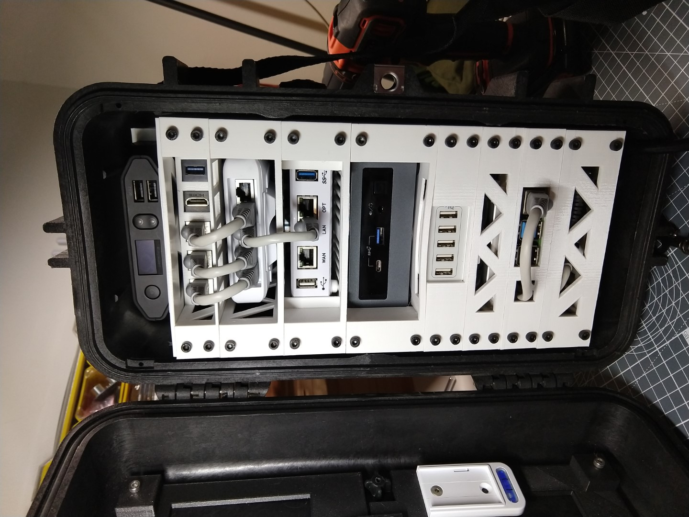
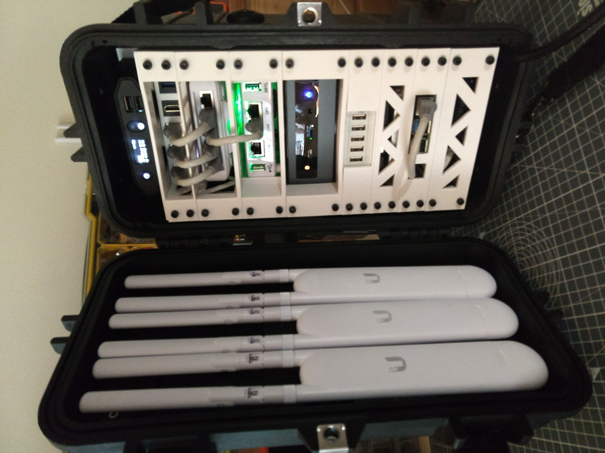

# Set Up your Nimble

>!! **TODO**
>!!
>!! * How do we power it on?!
>!! * Are there other set up steps!?

{{BOM}}

## Mount the rack and access points{pagestep}

* Take your wired Nimble rack and insert into your Peli Case.

* Take the three [UniFi Access Points](parts/UniFiAccessPoints.md){qty:3, cat:net} and clip them onto the mounting brackets in the Peli Case lid.

## Power on the system

