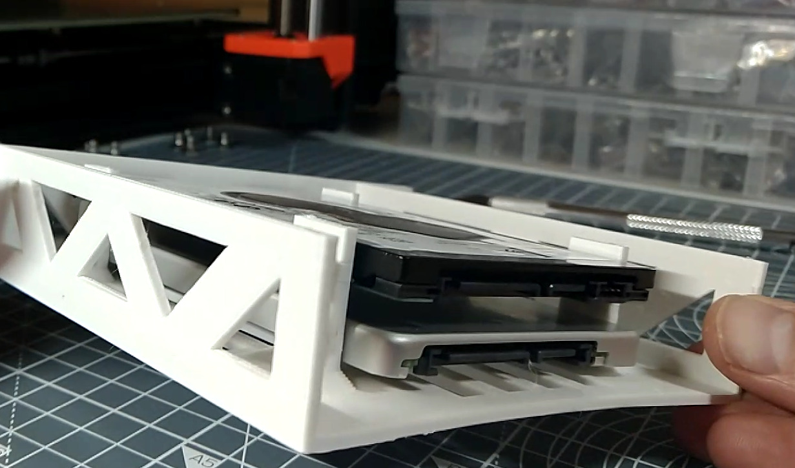
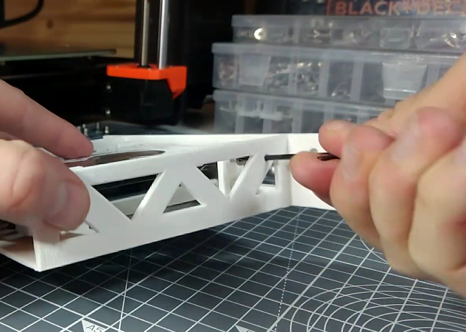

# The SSD Shelf

## Assembling the SSD Shelf

{{BOM}}

[M3x6mm low profile cap screws]: parts/Hardware.yaml#LowProfile_CapScrew_M3x6mm_SS

## Position the drives {pagestep}

* Take the [SSD shelf]{make, qty:1, cat:printed} you printed earlier
* Position two [2.5 inch SSD drives](parts/SSD.md){qty:2, cat:net} on the shelf so that the conectores are visible at the rear

## Secure the SSDs {pagestep}

* Each drive is secured with four our [M3x6mm low profile cap screws]{qty:8}
* Lift the dive so that it aligns with the holes. Secure the screw with a [2.5mm Allen key](parts/metric_allen_keys.md){qty:1, cat:tool}

