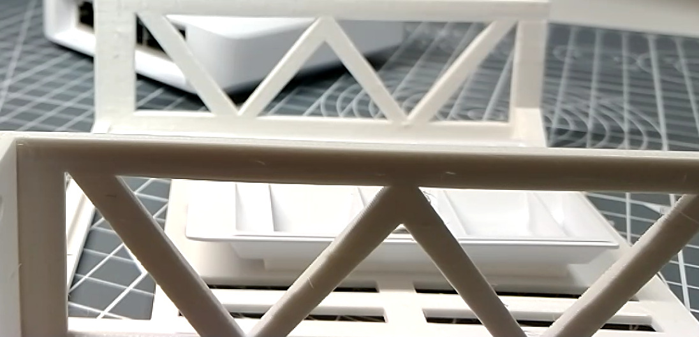
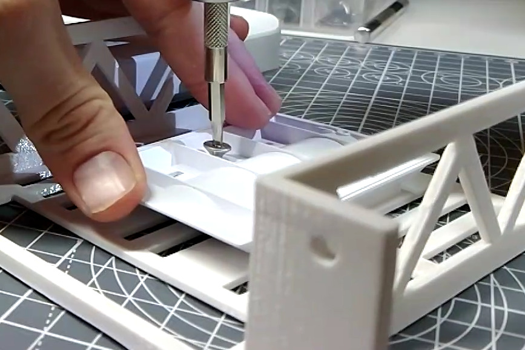
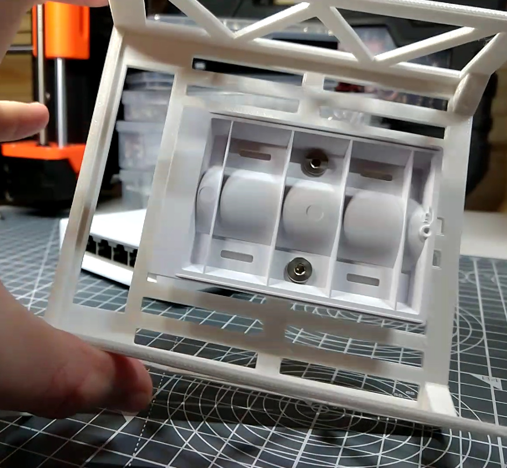
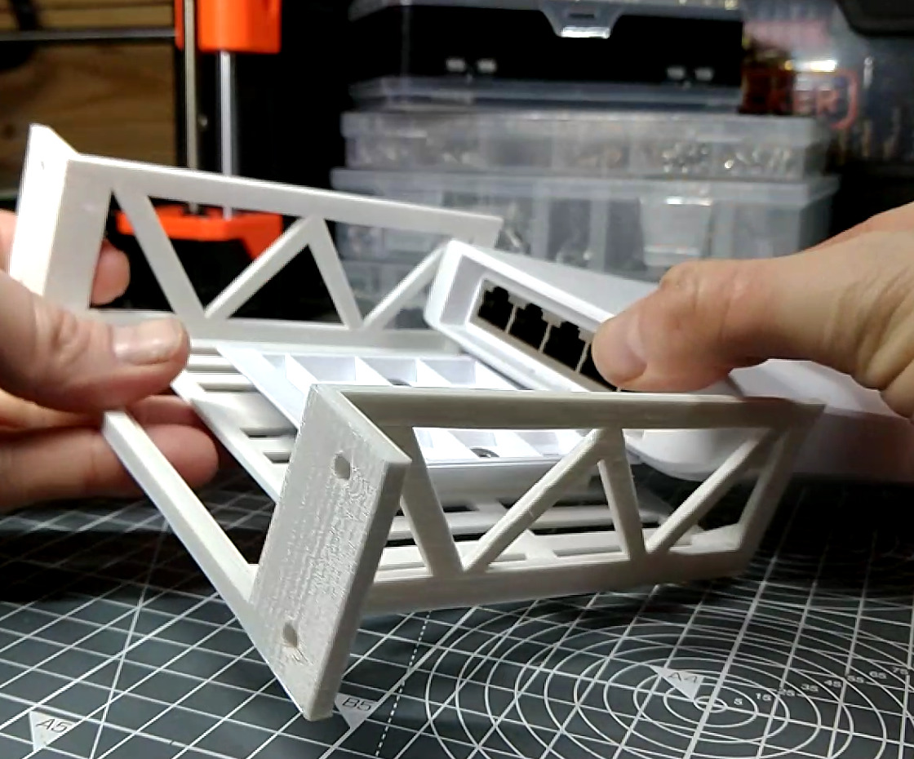
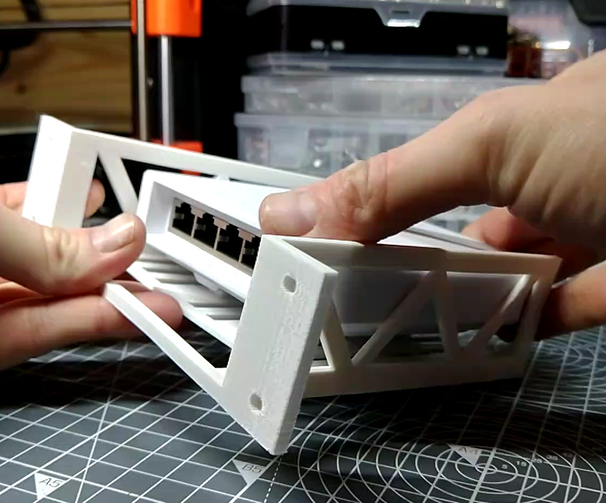
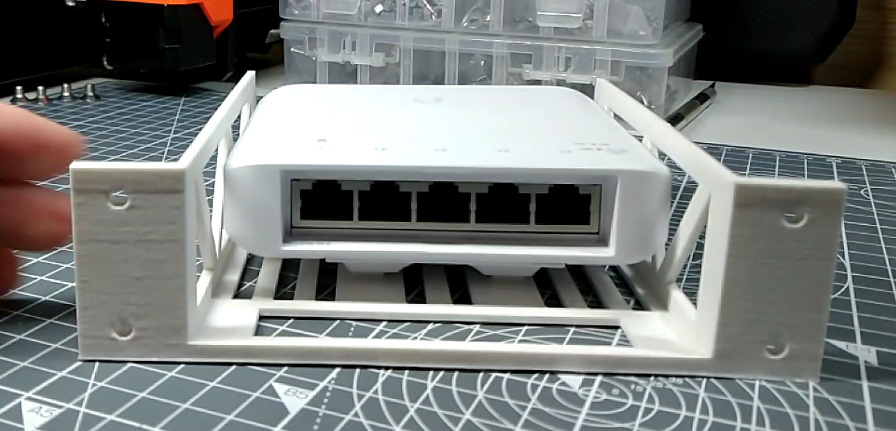

# The UniFi Flex Switch Shelf

## Assembling the UniFi Flex Switch Shelf

{{BOM}}

[M3x6mm countersunk screws]: parts/Hardware.yaml#CskScrew_M3x6mm_SS

## Prepare the tray {pagestep}

* Take the [UniFi Switch Shelf]{make, qty:1, cat:printed} you printed earlier and UniFi Switch Mounting Bracket (This should come with the switch)
* Place the bracket on the tray so that the extended flat raised section faced the front of the tray

* Align the two countersunk holes in the bracket with the holes in the tray.
* Use two [M3x6mm countersunk screws]{qty:2} and an [2.5mm Allen key](parts/metric_allen_keys.md){qty:1, cat:tool} to secure the mount

## Secure the Switch{pagestep}

* Take the [UniFi Flex Switch](parts/UniFiFlex.md){qty:1, cat:net} and hold it behind the tray and bracket
* Slide the switch onto the bracket until it is secure

