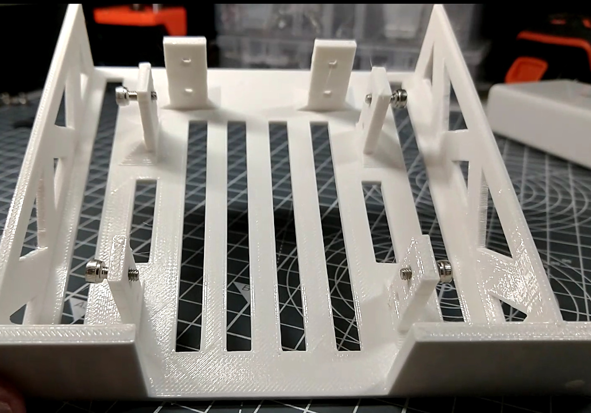
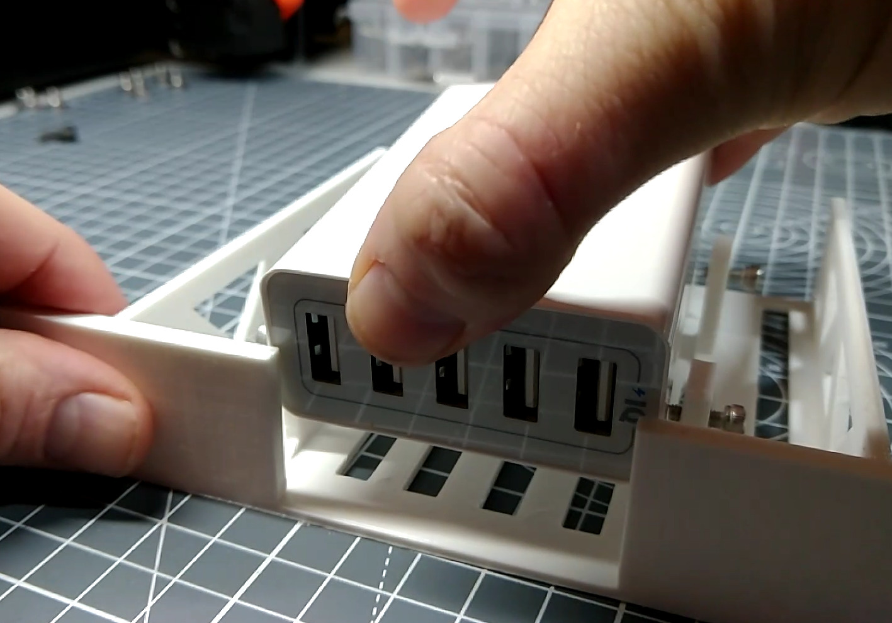

# The USB Power Shelf

## Assembling the USB Power Shelf

{{BOM}}

[M3x12mm cap screws]: parts/Hardware.yaml#CapScrew_M3x12mm_SS

## Prepare the tray {pagestep}

* Take the [USB Power Shelf]{make, qty:1, cat:printed} you printed earlier and a [2.5mm Allen key](parts/metric_allen_keys.md){qty:1, cat:tool}.
* Lightly screw a [M3x12mm cap screw][M3x12mm cap screws]{qty:4} into the top hole of each of the 4 side-posts.
* Make sure each screw is inserted less than half way.

## Secure the Power Adapter {pagestep}

* Position the [Anker USB Power Adapter](parts/AnkerUSBPower.md){qty:1, cat:net} on the shelf so that the ports are visible through the front of the tray

* Tighten each screw until the power adapter is held firmly
*{warning}  Do not over tighten the screws in this step as this may damage the plastic. 

